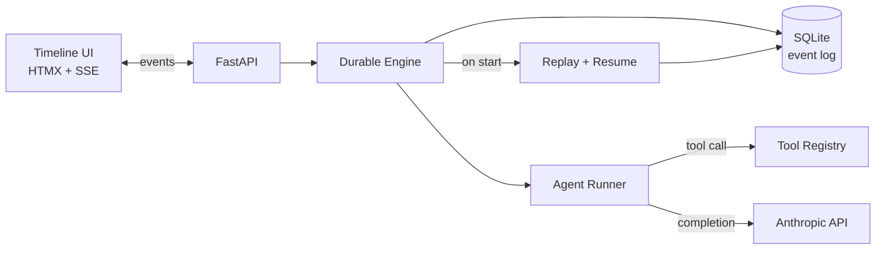

# Waypoint

**Your agents crash. Waypoint resumes them.**

Most agent frameworks treat LLM workflows like stateless HTTP handlers — crash mid-run, lose everything. Waypoint is a reference implementation of *durable agent orchestration*: every LLM call, tool execution, and handoff is committed to an event log before it's considered done. Kill the process, restart it, and Waypoint replays the log to resume from the exact next pending step — no repeated API charges, no double-executed tools.

## Demo (60 seconds)

```bash
cp .env.example .env   # add your ANTHROPIC_API_KEY
uv run waypoint serve  # or: docker compose up
```

Open `http://localhost:8000`.

1. Click **Run: Research Team** — query: *"State of MCP servers in 2026"*
2. Watch the timeline light up: Planner thinks → emits plan → hands off to Researcher
3. Researcher starts calling `fetch_url` — three URL cards stream in live
4. Click the red **Kill Worker** button mid-run — process dies
5. Run `uv run waypoint serve` again — timeline reconnects
6. Waypoint replays the event log, notices the Researcher was mid-loop, resumes from the last committed tool call, finishes cleanly
7. Final summary appears; the timeline shows a **"resumed here"** marker

## Why durable matters

| Without Waypoint | With Waypoint |
|---|---|
| Crash mid-tool-call → silent data loss | Every side effect is committed before acknowledged |
| Restart → re-run everything from scratch | Replay folds the event log; no duplicate LLM charges |
| Hard to debug what an agent actually did | Full event history queryable in SQLite |

## Architecture



**Event types:** `RunStarted`, `AgentStepStarted`, `LLMCallCommitted`, `ToolCallCommitted`, `HandoffCommitted`, `AgentStepFinished`, `RunFinished`, `RunFailed`

**The invariant:** no side effect happens without a preceding committed event, and no event is committed until its side effect has succeeded and been persisted with its result. Replay is a pure fold over the log.

## Quickstart

### With uv (recommended)

```bash
uv sync
cp .env.example .env
# edit .env — set ANTHROPIC_API_KEY
uv run waypoint --version   # works now
uv run pytest               # agent core tests pass without an API key (M2)
uv run waypoint serve       # available in M3
```

### With Docker

```bash
cp .env.example .env
docker compose up
```

## Project layout

```
src/waypoint/       # core library
  cli.py            # typer CLI entry point
  tools.py          # Tool + ToolResult primitives
  agent.py          # Agent: Anthropic tool-use loop
  builtin_tools.py  # fetch_url, sum_numbers
  engine.py         # durable execution engine  (M3+)
  events.py         # event log (SQLite)         (M3+)
  api.py            # FastAPI + SSE              (M3+)
tests/
  test_version.py   # CLI smoke test
  test_agent.py     # agent loop tests (mocked client)
examples/
  research_team/    # Planner → Researcher       (M4+)
  code_reviewer/    # Reader → Critic → Summary  (M4+)
docs/
```

## Milestones

| Milestone | Status | Description |
|---|---|---|
| M1 | ✅ done | Scaffold, README, CLI stub, CI wiring |
| M2 | ✅ done | Agent core: Tool primitive, tool-use loop, builtin tools |
| M3 | planned | FastAPI + SSE backend, timeline UI |
| M4 | planned | Example workflows, Docker Compose |

## What works now (M2)

### Agent primitives

- **`Tool` + `ToolResult`** (`src/waypoint/tools.py`) — wraps any Python callable (sync or async) with an Anthropic-compatible JSON Schema; `to_api_dict()` produces the shape the SDK expects; `dispatch(**kwargs)` runs sync callables in a thread via `asyncio.to_thread`
- **`Agent`** (`src/waypoint/agent.py`) — drives a full Anthropic tool-use loop until `stop_reason == "end_turn"`; collects tool-use blocks, dispatches them concurrently with `asyncio.gather`, feeds results back as `tool_result` user turns
- **`AgentResult`** — carries the final text output and the full message history (for handoffs in M4)
- **Builtin tools** (`src/waypoint/builtin_tools.py`) — `fetch_url` (httpx GET, first 4000 chars) and `sum_numbers` (sum of a list)
- **Tests** (`tests/test_agent.py`) — three tests with a mocked `AsyncAnthropic` client; no real API calls, no network required

### M1 (still works)

- **CLI entry point** — `waypoint --version` via Typer (`src/waypoint/cli.py`)
- **Package wiring** — `src/waypoint/__init__.py` exports `__version__ = "0.1.0"`; `py.typed` marker included
- **Toolchain** — `pyproject.toml` with hatchling build, ruff (E/W/F/I), pytest + pytest-asyncio pointed at `tests/`

Everything else (`engine.py`, `events.py`, `api.py`, example workflows, the timeline UI) is planned — see the milestone table.

## Contributing

This is a reference implementation — PRs that add features outside the scope above are unlikely to be merged. Bug fixes and clearer explanations are welcome.

## License

MIT © Ritik, 2026
