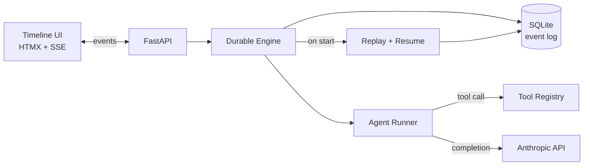

# Waypoint

**Your agents crash. Waypoint resumes them.**

Most agent frameworks treat LLM workflows like stateless HTTP handlers — crash mid-run, lose everything. Waypoint is a reference implementation of *durable agent orchestration*: every LLM call, tool execution, and handoff is committed to an event log before it's considered done. Kill the process, restart it, and Waypoint replays the log to resume from the exact next pending step — no repeated API charges, no double-executed tools.

## Demo (60 seconds)

```bash
cp .env.example .env   # add your ANTHROPIC_API_KEY
uv run waypoint serve  # or: docker compose up
```

Open `http://localhost:8000`.

1. Click **Run: Research Team** — query: *"State of MCP servers in 2026"*
2. Watch the timeline light up: Planner thinks → emits plan → hands off to Researcher
3. Researcher starts calling `fetch_url` — three URL cards stream in live
4. Click the red **Kill Worker** button mid-run — process dies
5. Run `uv run waypoint serve` again — timeline reconnects
6. Waypoint replays the event log, notices the Researcher was mid-loop, resumes from the last committed tool call, finishes cleanly
7. Final summary appears; the timeline shows a **"resumed here"** marker

## Why durable matters

| Without Waypoint | With Waypoint |
|---|---|
| Crash mid-tool-call → silent data loss | Every side effect is committed before acknowledged |
| Restart → re-run everything from scratch | Replay folds the event log; no duplicate LLM charges |
| Hard to debug what an agent actually did | Full event history queryable in SQLite |

## Architecture



**Event types:** `RUN_STARTED`, `AGENT_STEP_STARTED`, `LLM_CALL_STARTED`, `LLM_CALL_COMMITTED`, `TOOL_CALL_STARTED`, `TOOL_CALL_COMMITTED`, `HANDOFF_COMMITTED`, `AGENT_STEP_FINISHED`, `RUN_FINISHED`, `RUN_FAILED`

**The invariant:** no side effect happens without a preceding committed event, and no event is committed until its side effect has succeeded and been persisted with its result. Replay is a pure fold over the log.

## Quickstart

### With uv (recommended)

```bash
uv sync
cp .env.example .env
# edit .env — set ANTHROPIC_API_KEY
uv run waypoint --version   # works now
uv run pytest               # all tests pass without an API key
uv run python examples/research_team.py  # requires ANTHROPIC_API_KEY
```

### With Docker

```bash
cp .env.example .env
docker compose up
```

## Project layout

```
src/waypoint/       # core library
  cli.py            # typer CLI entry point
  tools.py          # Tool + ToolResult primitives
  agent.py          # Agent: Anthropic tool-use loop
  builtin_tools.py  # fetch_url, sum_numbers
  engine.py         # durable execution engine  (M3+)
  events.py         # event log (SQLite)         (M3+)
  workflow.py       # Workflow + WorkflowRunner  (M4+)
  api.py            # FastAPI + SSE              (planned)
tests/
  test_version.py   # CLI smoke test
  test_agent.py     # agent loop tests (mocked client)
  test_engine.py    # durable engine scenarios   (M3+)
  test_workflow.py  # multi-agent workflow tests (M4+)
examples/
  research_team.py  # Planner → Researcher       (M4+)
docs/
```

## Milestones

| Milestone | Status | Description |
|---|---|---|
| M1 | ✅ done | Scaffold, README, CLI stub, CI wiring |
| M2 | ✅ done | Agent core: Tool primitive, tool-use loop, builtin tools |
| M3 | ✅ done | Event-sourced durable engine: SQLite event log, write-ahead pattern, replay + resume |
| M4 | ✅ done | Multi-agent workflows + handoffs: `Workflow`, `WorkflowRunner`, `HANDOFF_COMMITTED` event, `research_team` example |
| M5 | planned | FastAPI + SSE backend, timeline UI, Docker Compose |

## What works now (M4)

### Multi-agent workflows + handoffs

- **`workflow.py`** (`src/waypoint/workflow.py`) — `Workflow` (named dict of `Agent` nodes + entry point), `WorkflowRunner` (executes agents in sequence, routing via `handoff`), `HandoffSignal` (exception raised by the injected `handoff` tool), `Handoff` (target + payload dataclass).
- **`handoff` tool injection** — `WorkflowRunner` injects a `handoff` tool into each agent listing all other agent names as valid targets. The tool raises `HandoffSignal`; the engine catches it, commits a `HANDOFF_COMMITTED` event, and returns an `AgentResult` with a `handoff` field.
- **Agent-scoped replay** — `replay(db_path, run_id, agent_name=...)` filters events by agent, preventing a Planner's committed LLM responses from bleeding into the Researcher's cursor on resume.
- **`research_team` example** (`examples/research_team.py`) — Planner → Researcher with `fetch_url`; run with `uv run python examples/research_team.py` after setting `ANTHROPIC_API_KEY`.
- **Tests** (`tests/test_workflow.py`) — two scenarios with mocked client: handoff event ordering asserted end-to-end; pre-seeded planner log verified to skip live LLM call on resume with no duplicate `HANDOFF_COMMITTED`.

### M3 (still works)

- **`events.py`** (`src/waypoint/events.py`) — SQLite-backed event log with WAL mode; `migrate()` sets up the schema, `append()` writes a single event, `list_events()` reads in order.
- **`replay(db_path, run_id)`** — pure fold over the event log; returns a `ReplayState` with committed LLM responses, tool results, and handoff. No side effects.
- **`DurableRunner`** (`src/waypoint/engine.py`) — write-ahead agent loop: appends `*_STARTED` before the side effect, `*_COMMITTED` after. On startup it replays the log and skips already-completed steps — no duplicate LLM charges, no double tool execution.
- **Idempotency key** — `Tool.idempotency_key: str | None` stored in `TOOL_CALL_STARTED` events for future deduplication.
- **Tests** (`tests/test_engine.py`) — five scenarios with mocked client and temp SQLite: replay empty, happy path event ordering, crash between LLM writes, tool result replayed from log, crash between tool writes triggers re-execution.

### M2 (still works)

- **`Tool` + `ToolResult`** (`src/waypoint/tools.py`) — wraps any Python callable (sync or async) with an Anthropic-compatible JSON Schema; `to_api_dict()` produces the shape the SDK expects; `dispatch(**kwargs)` runs sync callables in a thread via `asyncio.to_thread`
- **`Agent`** (`src/waypoint/agent.py`) — drives a full Anthropic tool-use loop until `stop_reason == "end_turn"`; collects tool-use blocks, dispatches them concurrently with `asyncio.gather`, feeds results back as `tool_result` user turns
- **Builtin tools** (`src/waypoint/builtin_tools.py`) — `fetch_url` (httpx GET, first 4000 chars) and `sum_numbers` (sum of a list)

### M1 (still works)

- **CLI entry point** — `waypoint --version` via Typer (`src/waypoint/cli.py`)
- **Package wiring** — `src/waypoint/__init__.py` exports `__version__ = "0.1.0"`; `py.typed` marker included
- **Toolchain** — `pyproject.toml` with hatchling build, ruff (E/W/F/I), pytest + pytest-asyncio pointed at `tests/`

The FastAPI + SSE backend and timeline UI are planned — see the milestone table.

## Contributing

This is a reference implementation — PRs that add features outside the scope above are unlikely to be merged. Bug fixes and clearer explanations are welcome.

## License

MIT © Ritik, 2026
