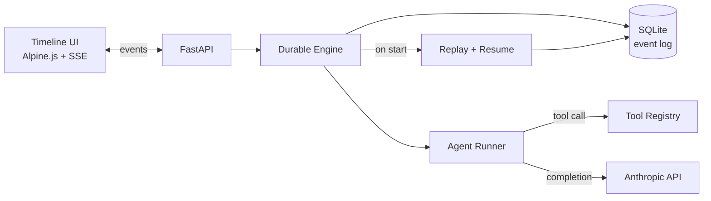

# Waypoint — Durable Multi-Agent Workflows with a Visual Timeline

> Event-sourced multi-agent orchestrator: kill it mid-run, restart it, watch it resume from the last checkpoint in a live timeline UI.

<!-- TODO: replace with a 5-10 second demo gif. Record with ScreenToGif on
     Windows or peek on macOS. Save to docs/demo.gif and update path here. -->


## What it is

Waypoint is a reference implementation of durable agent orchestration. You define a workflow as a directed graph of cooperating agents; the engine executes it while appending every LLM call, tool execution, and handoff to a SQLite event log before treating each step as done. Kill the process at any point, restart it, and Waypoint replays the log to resume from the exact next pending step — no repeated API charges, no double-executed tools.

The project ships two example workflows (a two-agent research team and a three-agent code reviewer), a FastAPI + SSE backend that streams events to the browser as they land, and a lightweight timeline UI with per-agent swimlanes, click-to-expand event cards, and a "Kill Worker" button for the crash-resume demo.

## Quickstart

```bash
git clone https://github.com/RitikPatill/waypoint-agents.git
cd waypoint-agents
uv sync
cp .env.example .env
# edit .env — set ANTHROPIC_API_KEY
uv run waypoint serve
```

Open `http://localhost:8000`. To run without Docker or uv, see the Docker path below:

```bash
cp .env.example .env
docker compose up
```

Tests pass without an API key:

```bash
uv run pytest
```

## Usage

Open `http://localhost:8000`. The run form offers two workflows from a dropdown.

**Crash-resume demo (research_team)**

Select `research_team`, enter a prompt such as `State of MCP servers in 2026`, and click Run. The timeline shows the Planner agent reasoning and handing off to the Researcher, which begins streaming `fetch_url` tool calls as cards. Click the red **Kill Worker** button mid-run. Run `uv run waypoint serve` again — Waypoint replays the event log, detects the interrupted run, resumes from the last committed tool call, and marks the timeline with a dashed "resumed here" divider.

**Code reviewer demo (code_reviewer)**

Select `code_reviewer` and enter `examples/fixtures/buggy_sample.py`. Reader reads the file, Critic identifies bugs with line references, and Summarizer produces a P1/P2/P3 action list across three swimlanes.

To start a run without the browser:

```bash
curl -s -X POST http://localhost:8000/runs \
  -H 'Content-Type: application/json' \
  -d '{"workflow": "research_team", "prompt": "State of MCP servers in 2026"}'
```

## Architecture


```mermaid
flowchart LR
    UI[Timeline UI<br/>Alpine.js + SSE] <-->|events| API[FastAPI]
    API --> Engine[Durable Engine]
    Engine --> EventLog[(SQLite<br/>event log)]
    Engine --> Runner[Agent Runner]
    Runner -->|tool call| Tools[Tool Registry]
    Runner -->|completion| Anthropic[Anthropic API]
    Engine -->|on start| Replay[Replay + Resume]
    Replay --> EventLog
```

The core invariant: no side effect happens without a preceding committed event, and no event is committed until its side effect has succeeded and been persisted with its result. Replay is a pure fold over the log — it never touches the Anthropic API.

## Project structure

```
src/waypoint/       # core library
  engine.py         # durable execution engine: write-ahead pattern, replay, resume
  events.py         # SQLite event log: append, list, replay fold
  workflow.py       # Workflow + WorkflowRunner + HandoffSignal
  agent.py          # Anthropic tool-use loop
  api.py            # FastAPI routes + SSE streaming
  pubsub.py         # in-process asyncio event bus
  workflows.py      # built-in workflow registry
  builtin_tools.py  # fetch_url, read_file, sum_numbers
  cli.py            # Typer CLI entry point
  static/           # timeline SPA (Alpine.js + Pico.css, no bundler)
tests/              # pytest suite; all scenarios run without an API key
examples/           # research_team.py, code_reviewer.py, fixtures/
docs/               # architecture reference, roadmap, screenshot, demo gif
scripts/            # record_demo.sh — drives crash-resume end-to-end via curl
```

## Roadmap

- [ ] PostgreSQL backend with `LISTEN/NOTIFY` to support multi-process workers
- [ ] `LLMClient` protocol abstraction to support OpenAI and Gemini alongside Anthropic
- [ ] Per-agent retry policies and wall-clock timeout budgets
- [ ] JSON Schema validation for typed handoff payloads between agents
- [ ] Workflow versioning: tag runs with the workflow definition hash so replays use the original configuration

## License

MIT — see LICENSE.

---

Built autonomously by [autodev](https://github.com/RitikPatill/autodev),
a multi-agent orchestrator I designed. Each commit in this repo was
authored by me; the implementation work was performed by Sonnet under
the orchestrator's control. Read the orchestrator's README to see how.
