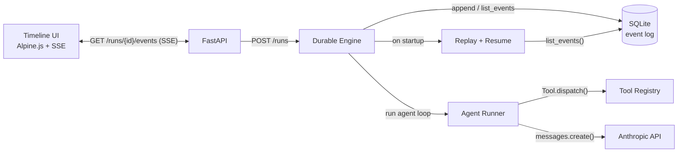

# Architecture

## System diagram



## Components

**Timeline UI** (`src/waypoint/static/index.html`) — Alpine.js single-page app served over plain HTTP. Connects to the SSE stream for a run and renders one swimlane column per agent. Each event becomes a `<details>` card; clicking expands the raw JSON payload. A Kill Worker button POSTs to `/debug/kill-worker` to demonstrate crash-resume live.

**FastAPI** (`src/waypoint/api.py`) — thin HTTP layer. `POST /runs` starts a workflow as an asyncio background task. `GET /runs/{id}/events` opens an SSE stream that first replays all historical events (reconnect-safe) then streams live ones via an in-process pub/sub queue. `POST /debug/kill-worker` sends SIGTERM for the demo.

**Durable Engine** (`src/waypoint/engine.py`) — the core write-ahead agent loop. Wraps every LLM call and tool execution in the STARTED → side-effect → COMMITTED sequence. On startup it calls `replay()` and skips any step that already has a `*_COMMITTED` event in the log.

**EventLog** (`src/waypoint/events.py`) — append-only SQLite table in WAL mode. `append(db_path, run_id, event_type, payload)` is the only write path. `list_events(db_path, run_id)` is the only read path. No updates, no deletes.

**Agent Runner** (`src/waypoint/agent.py`) — drives a single Anthropic tool-use loop until `stop_reason == "end_turn"`. Dispatches all tool-use blocks concurrently with `asyncio.gather`. Raises `HandoffSignal` when the injected `handoff` tool is called.

**Tool Registry** (`src/waypoint/tools.py`, `src/waypoint/builtin_tools.py`, `src/waypoint/workflows.py`) — `Tool` wraps any Python callable with an Anthropic-compatible JSON Schema. `dispatch()` runs sync callables in a thread via `asyncio.to_thread`. Built-in tools: `fetch_url`, `sum_numbers`, `read_file` (with path allowlist).

**Replay + Resume** (`src/waypoint/events.py` `replay()`, `src/waypoint/workflow.py` `WorkflowRunner`) — on startup, `list_running_runs()` finds interrupted runs. `replay()` folds the event log into a `ReplayState`. `WorkflowRunner.run()` reads the state and resumes from the last `HANDOFF_COMMITTED` or the entry point.

---

## Event types

| Event | When emitted | Payload fields | Notes |
|---|---|---|---|
| `RUN_STARTED` | Before the first agent step | `workflow`, `prompt` | Marks the run as in-flight; idempotent — not re-appended on resume |
| `RUN_RESUMED` | On startup, when an interrupted run is detected | `resumed_from_agent` | Injected once before replay continues; displayed as the "resumed here" marker in the UI |
| `AGENT_STEP_STARTED` | Before entering each agent | `agent` | Re-entry of a finished agent is blocked by `AGENT_STEP_FINISHED` check |
| `LLM_CALL_STARTED` | Before the Anthropic API call | `agent`, `messages` | Write-ahead: committed only if the call succeeds |
| `LLM_CALL_COMMITTED` | After the API response is received | `agent`, `response` | Replay returns this response directly without re-calling the API |
| `TOOL_CALL_STARTED` | Before the tool function executes | `tool`, `args`, `idempotency_key` | Write-ahead: if process dies here, tool is re-executed on replay |
| `TOOL_CALL_COMMITTED` | After the tool function returns | `tool`, `result` | Replay returns the cached result; tool function is not called again |
| `HANDOFF_COMMITTED` | After a `HandoffSignal` is caught | `from_agent`, `to_agent`, `payload` | Determines which agent to resume on restart |
| `AGENT_STEP_FINISHED` | After an agent returns (no handoff) | `agent` | Replay skips re-entering this agent |
| `RUN_FINISHED` | After the last agent step completes | `summary` | Terminal state; run is excluded from `list_running_runs()` |
| `RUN_FAILED` | On an unhandled exception | `error` | Terminal state; run is excluded from `list_running_runs()` |

---

## The write-ahead pattern

Every side effect in Waypoint follows the same three-step sequence:

```python
# pseudocode — see engine.py for the real implementation
append(db, run_id, "TOOL_CALL_STARTED", {tool: name, args: args})   # 1. commit intent
result = tool.fn(**args)                                              # 2. execute
append(db, run_id, "TOOL_CALL_COMMITTED", {tool: name, result: r})  # 3. commit result
```

**If the process dies between step 1 and step 3:** on replay, the engine finds a `TOOL_CALL_STARTED` with no matching `TOOL_CALL_COMMITTED`. It re-executes the tool and commits the result. The tool sees exactly one execution from its perspective on every complete run.

**If the process dies after step 3:** on replay, the engine finds both events. It returns the cached result from the log and never calls the tool function again.

This is exactly-once semantics built on top of at-least-once infrastructure. The only requirement is that tool functions are safe to re-execute if interrupted mid-write (i.e., they should not have partially-visible side effects that can't be retried).

The same pattern applies to LLM calls: `LLM_CALL_STARTED` → `messages.create()` → `LLM_CALL_COMMITTED`. A crash after the API responds but before the commit causes one redundant API call on resume — acceptable given that LLM calls are idempotent from the caller's perspective.

---

## Replay as a fold

`replay(db_path, run_id)` in `events.py` reads all events for a run in insertion order and reduces them into a `ReplayState`:

```python
@dataclass
class ReplayState:
    committed_llm_responses: dict[str, Any]   # keyed by message sequence hash
    committed_tool_results: dict[str, Any]    # keyed by idempotency_key or call index
    last_handoff: Handoff | None
    finished_agents: set[str]
    status: str  # "running" | "finished" | "failed"
```

The fold is a pure function: it reads the database once, performs no I/O, and never touches the Anthropic API. `WorkflowRunner.run()` calls `replay()` on startup, inspects the state, and decides which agent to enter next and with which payload — without re-executing any already-committed step.
